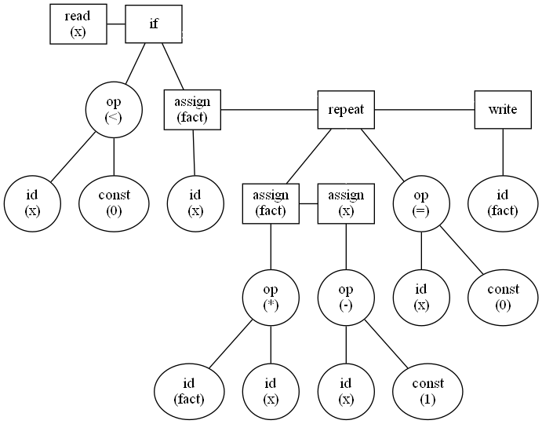

# Tiny-Language-Compiller

First install Graphviz https://www.graphviz.org/download/ and make sure it's working properly

## Example


### Code :
```
{Sample program in TINY language — computes factorial}
read x; {input an integer }
if x < 0 then { don't compute if x}
fact := x ;
repeat
fact := fact * x;
x := x-1
until x = 0;
write fact { output factorial of x}
end

```
### Output

